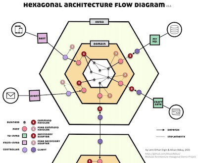
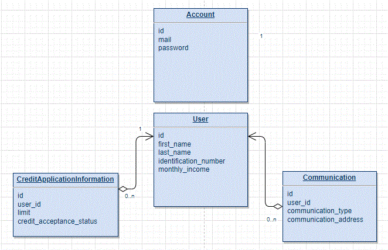

# Credit Application System

This project is a credit application system demo for Payten

---

## Table of Contents
- [Credit Application System](#credit-application-system)
  - [Table of Contents](#table-of-contents)
  - [How to build](#how-to-build)
  - [Reports](#reports)
    - [Hexagonal Architecture Flow Diagram (click to enlarge)](#hexagonal-architecture-flow-diagram-click-to-enlarge)
    - [Database Diagram](#database-diagram)
    - [Motivation](#motivation)
    - [What is the Hexagonal Architecture](#what-is-the-hexagonal-architecture)
    - [Technologies Used](#technologies-used)
    - [Author](#author)

---

## How to build

> - Make sure your computer has docker,java17 and maven installed
> - Open your terminal and enter the CreditSystem folder with the cd command
> - Run "mvn clean install -U -DskipTests=true"
> - Run "docker-compose up" 
> - Go to "http://localhost:8080/swagger-ui/index.html#/" from browser
> - Create a new account with /accounts end point
> - Get token by entering the account information you created with /login end point
> - Enter token by pressing the Authorize button on the top right, adding Bearer to the head of the value section
> - And now you can use all the end-pointes :blush:

## Reports
* [Sonar Report](https://sonarcloud.io/dashboard?id=hex)

---

### Hexagonal Architecture Flow Diagram (click to enlarge)

---

### Database Diagram

---

### Motivation

I want to write clean, sustainable, well-defined boundary context, well-tested domain code and isolate business logic from external concerns. Hexagonal architecture allows us to become domain software, which is a very comfortable way to change technology because it provides a loosely couple environment without the technical details of the project, and it also prepares our monolith-starting project for micro-servicers

---

### What is the Hexagonal Architecture

The hexagonal architecture was invented by Alistair Cockburn in an attempt to avoid known structural pitfalls in object-oriented software design, such as undesired dependencies between layers and contamination of user interface code with business logic, and published in 2005.

> A timeless goal of software engineering has been to separate code that changes frequently from code that is stable.
>
> ~ James Coplien / Lean Architecture

We recommend Hexagonal Architecture for those who want to write clean, maintainable, well-defined boundary context, well-tested domain, and decoupling business logic from technical code.

---

### Technologies Used

Here is the list of technologies I used for the Credit Application System;

* Spring Boot 2
* Java 17
* Docker
* PostgreSql
* Redis(**Used redis at end point /creditapplicationinformations/{identificationnumber}**)
* Custom Exception Handler
* Lombok
* Swagger UI
* Unit/Integration Tests

---

### Author
* **Semih Şahan**, Software Developer -> [Github](https://github.com/semihshn), [Twitter](https://twitter.com/Semih87059904), [Linkedin](https://www.linkedin.com/in/semih%C5%9Fahan/)